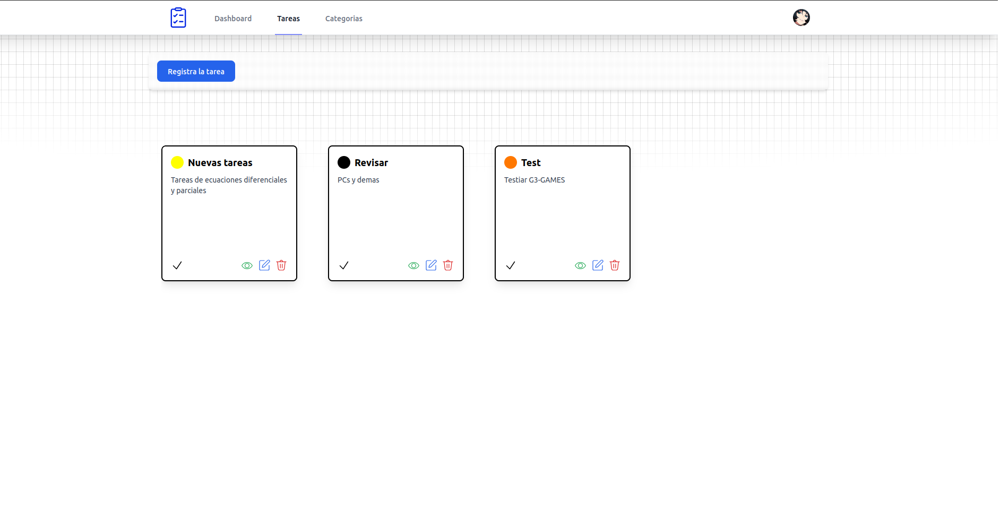
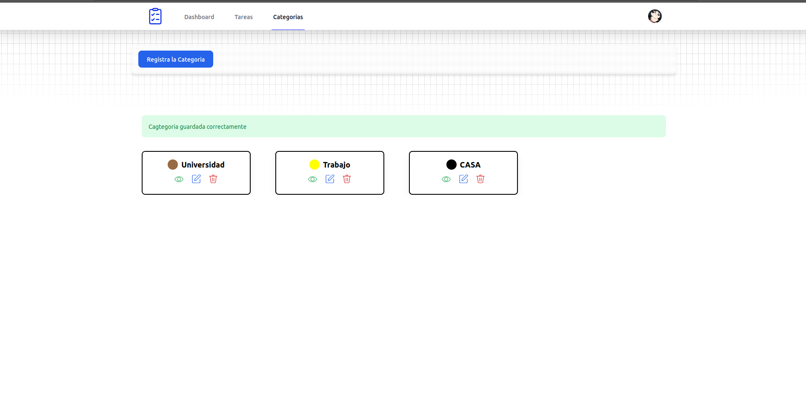

## 
<strong>Todo List Laravel</strong>

 

## Sobre Todo List

Todo List Laravel es una aplicación diseñada para ayudarte a organizar tus tareas de manera eficiente y práctica. Con una interfaz intuitiva y basada en el poderoso framework Laravel, esta herramienta te permitirá gestionar tus pendientes, categorizar tus actividades y mantener un seguimiento claro de tu productividad diaria. Todo está pensado para ofrecerte una experiencia de usuario agradable, ágil y personalizable, adaptándose a tus necesidades mientras exploras todo el potencial del ecosistema Laravel.

- Sesiones
- Crear Categorias
- Crear tareas

## Administrar tareas

Laravel has wonderful documentation covering every aspect of the framework. Whether you're new to the framework or have previous experience, we recommend reading all of the documentation from beginning to end.

## Administrar Categorias

Gestiona tus categorías de manera sencilla y eficiente. Este módulo te permite crear, editar y organizar las categorías para clasificar tus tareas de forma clara y estructurada. Con herramientas intuitivas y funcionales, puedes personalizar cada categoría según tus necesidades, facilitando el seguimiento y priorización de tus actividades.

